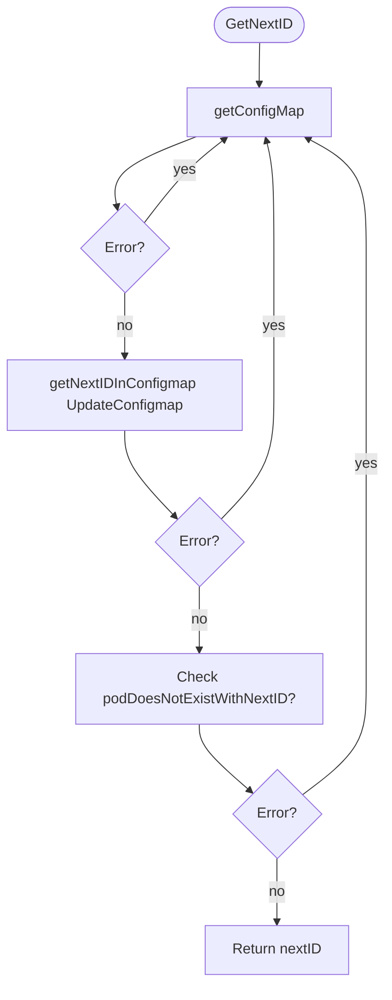
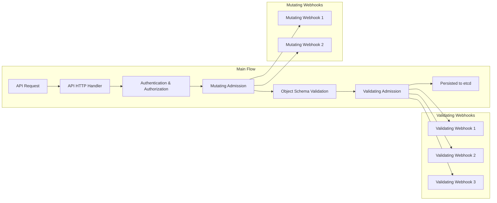

# Pod Tiny Tidy Identifier Webhook

PodTinyTidyId is a Kubernetes Mutating Webhook that assigns short, sequential IDs to sets of pods. If `$HOSTNAME` is too large for your needs, this webhook can help.

> **Note**: This is a prototype. In production, consider:
> - Kubernetes API rate limits
> - Possible identifier overflow when IDs reach the limit

---

## Webhook Configuration

Use a ConfigMap named `podtinytidyid-webhook` to configure identifier bits:

```yaml
generator:
  identifierBits: 15
```

---

## Pods Configuration

Label pods with your chosen **pod-set**:

```yaml
danieldorado.github.io/podtinytidyid-set=<my-pod-set>
```

All pods sharing the same set label will get unique IDs. Example Deployment:

```yaml
apiVersion: apps/v1
kind: Deployment
metadata:
  name: nginx-id
  namespace: examples
spec:
  replicas: 8
  selector:
    matchLabels:
      app: nginx
  template:
    metadata:
      labels:
        app: nginx
        danieldorado.github.io/podtinytidyid-set: my-id-set
    spec:
      containers:
      - name: nginx
        image: nginx:latest
```

Pods will have:
- `PODTINYTIDYID_ID` as an environment variable with a unique ID
- A label `danieldorado.github.io/podtinytidyid-id-my-id-set` for collision checks

Example output:
```sh
$ kubectl get pod -l "danieldorado.github.io/podtinytidyid-id-my-id-set" -o json | \
  jq -r '.items[]|"\(.metadata.name) \(.metadata.labels["danieldorado.github.io/podtinytidyid-id-my-id-set"]) \(.spec.containers[0].env)"'
nginx-id-5c4475fb7-2x9p2 42 [{"name":"PODTINYTIDYID_ID","value":"42"}]
nginx-id-5c4475fb7-79cpf 41 [{"name":"PODTINYTIDYID_ID","value":"41"}]
nginx-id-5c4475fb7-8xg2t 37 [{"name":"PODTINYTIDYID_ID","value":"37"}]
nginx-id-5c4475fb7-dvgbw 44 [{"name":"PODTINYTIDYID_ID","value":"44"}]
nginx-id-5c4475fb7-jh48g 40 [{"name":"PODTINYTIDYID_ID","value":"40"}]
```

---

## Uniqueness

The last IDs used for each set are stored in a ConfigMap:

```sh
$ kubectl get configmap podtinytidyid-counter -o yaml | yq .data

my-id-set-dev: "20"
my-id-set: "44"
other-set: "10"
```

A sequential approach combined with storing the counters prevents collisions like:

``` Mermaid
sequenceDiagram
    participant A as Webhook Thread 1
    participant B as Webhook Thread 2
    participant W as Webhook GetNext
    participant S as API Server

    A->>W: Call GetNext
    W-->>A: nextId = 351

    B->>W: Call GetNext
    W-->>B: nextId = 351

    A->>S: Check Pod existence for 351
    S-->>A: Pod not found

    B->>S: Check Pod existence for 351
    S-->>B: Pod not found

    A->>S: Create Pod with ID 351
    B->>S: Create Pod with ID 351
```

We assume that within 2**identifierBits ID cycles, any pod that might collide will already be persisted.

### Algorithm



---

## Kubernetes API Flow


